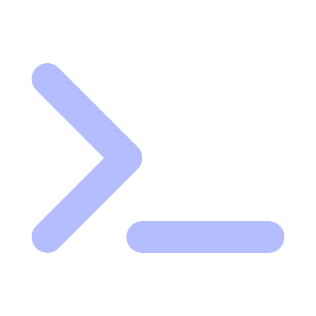

##  À propos

Je suis élève-ingénieur en cybersécurité à CY Tech.  
Mon travail s'articule entre l'ingénierie logicielle bas-niveau, la sécurité offensive, et la recherche appliquée.  
J'accorde une importance significative aux projets collaboratifs, à la réflexion partagée et à l'entrepreneuriat.

##  Environnement et outillage

- **OS** : Arch Linux / Hyprland
- **Workflow** : Neovim + tmux + pwndbg/gef + zsh
- **Langages** : C, Python, NASM, Lua
- **Style** : CLI/TUI-first, esthétique Catppuccin ☕
- **Philosophie** : Ambition, cadrage et engagement

##  Projets en cours

###  Proof Of Concept

- Black-Box Adversarial Attacks on Voice Authentication Systems : Revue de l'état de l'art et application

###  Recherche & Enseignement

- From Software Correctness to Security Assurance: Revisiting the Semantics of Testing in DevSecOps
- Cours de C et d'OCaml
